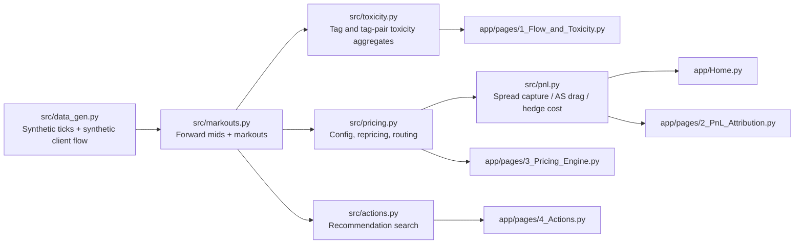

# FX Internalisation Dashboard

Interactive eFX internalisation simulator: pricing engine config, flow toxicity scoring, PnL attribution, recommendation engine.

## Screenshots

**Home — book KPIs, routing mix, and cumulative PnL attribution**


**Flow & Toxicity — markout curves, distributions, and tag-pair asymmetry**


**PnL Attribution — spread capture vs AS drag vs hedge cost**


**Actions — ranked recommendations with one-click apply**


## Quickstart

```bash
pip install -r requirements.txt
python -m src.data_gen
streamlit run app/Home.py
```

Run tests with:

```bash
pytest tests/ -v
```

## What It Models

This project simulates a market-maker internalisation book across synthetic G3 FX flow in `EURUSD`, `USDJPY`, and `GBPUSD`. The dashboard is framed as an operational desk tool: client flow arrives by tag, the pricing engine decides whether to internalise or hedge, and realised book PnL is decomposed into spread capture, adverse selection drag, and hedge cost.

The flow is synthetic and the toxicity is deliberately constructed. Each client tag injects a signed post-trade drift kernel into the future mid-price path, so tags such as `HFT_A` and `Bank_F` reliably show adverse LP markouts while `RetailAgg_D` remains close to flat. That keeps the economics legible and makes routing mistakes, threshold limits, and recommendation logic visible in the UI.

## Design Choices Worth Highlighting

- Reporting toxicity stays at 30 seconds, but routing toxicity is scored at the inventory hold horizon because that is where adverse selection is actually realised.
- Score-only routing misses notional leverage; the Actions page shows that `PB_C` is economically better hedged even though its toxicity score is only modest.
- The tag-pair heatmap surfaces pair-level asymmetry, which points naturally to future per-pair routing and widening rules.

## Core Formulas

LP-perspective markout at horizon \(T\):

\[
\text{markout}_{LP}(T) = s \cdot \left(P_{\text{exec}} - M_{t+T}\right)
\]

\[
\text{markout}_{bp}(T) = 10^4 \cdot \frac{\text{markout}_{LP}(T)}{M_t}
\]

where \(s = +1\) for a client buy and \(s = -1\) for a client sell.

Internalised trade PnL:

\[
\text{PnL}_{\text{internalise}} = \text{spread capture} - \text{adverse selection}
\]

Hedged trade PnL:

\[
\text{PnL}_{\text{hedge}} = \text{spread capture} - \text{hedge cost}
\]

Tag toxicity score:

\[
\text{toxicity score}(T) = -\mathbb{E}\left[\text{markout}_{bp}(T)\right]
\]

## Architecture



## Synthetic Data Model

Trades are stored as Polars frames with:

```python
{
    "ts": pl.Datetime,
    "pair": pl.Utf8,
    "tag": pl.Utf8,
    "side": pl.Utf8,
    "notional_usd": pl.Float64,
    "mid_at_trade": pl.Float64,
    "executed_price": pl.Float64,
}
```

Ticks are stored as `ts`, `pair`, `tick_index`, and `mid`, sampled every 100ms through a 10-hour session.

The key synthetic mechanism is the toxicity injection: after each trade, the generator adds a tag-specific signed drift curve over the next 300 seconds of returns. That produces stable, measurable post-trade markout signatures by tag without pretending the data came from a real production venue.

## Caveats

This is an illustrative simulator, not a production pricing stack. The data is synthetic, hedge cost is a static basis-point charge, and the model does not include inventory netting across tags, venue selection, or time-varying external liquidity conditions. The point is to make internalisation economics and routing trade-offs explicit, inspectable, and testable.
