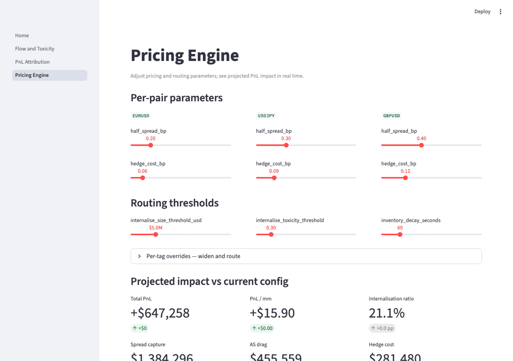
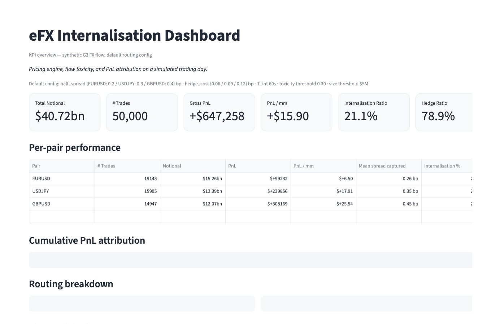
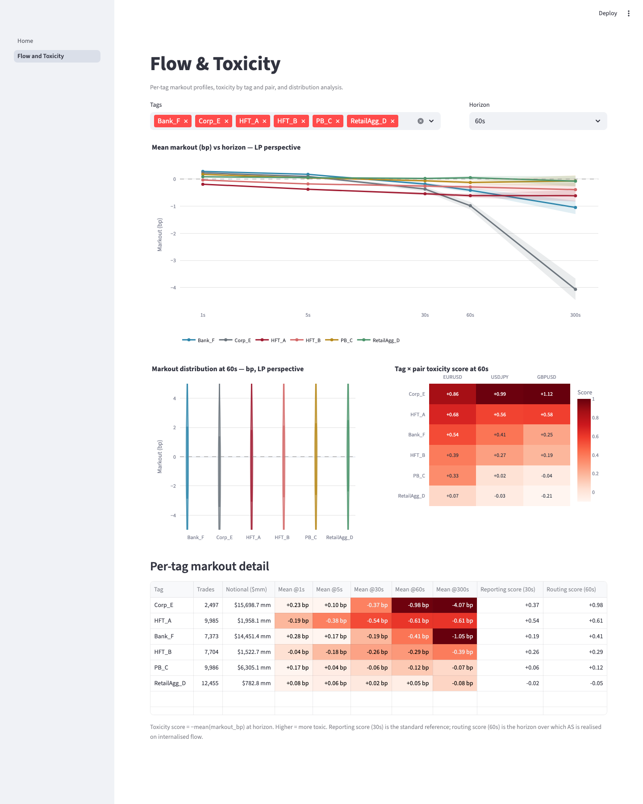
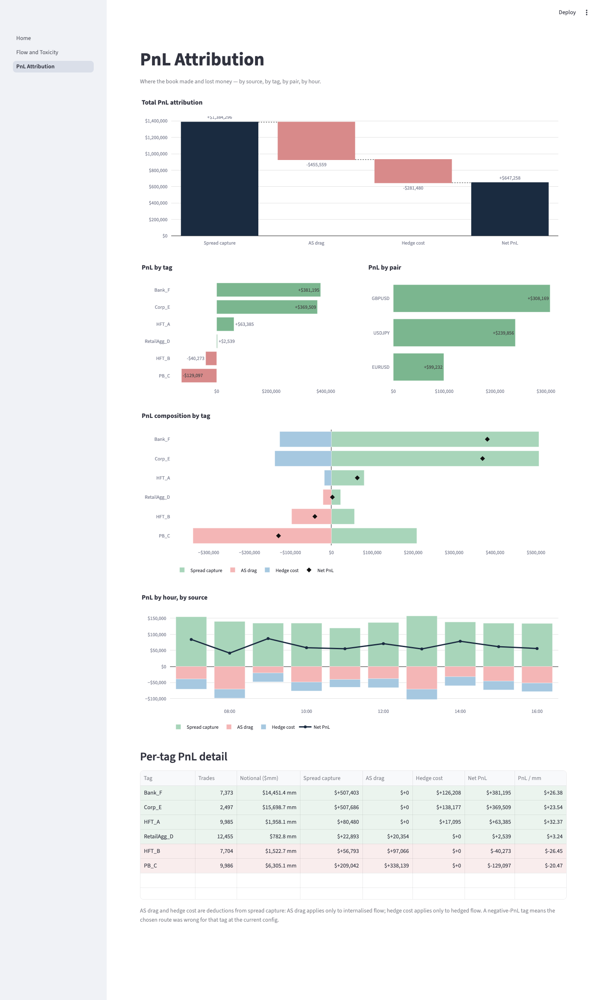
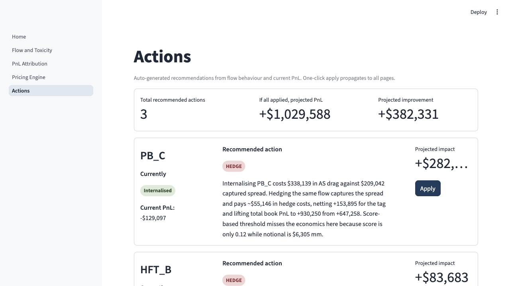

# FX Internalisation Dashboard

Interactive Streamlit dashboard for analysing the pricing, routing, and PnL of a market-maker's internalisation book in spot FX.

## Overview

The purpose of this project is not to build a production eFX pricing engine. It is to demonstrate the operational analytical workflow behind eFX internalisation: ingesting tick-level flow, scoring each client tag's toxicity at multiple horizons, decomposing realised PnL into spread capture / adverse selection / hedge cost, and surfacing pricing or routing changes that improve the book.

The example uses synthetic G3 client flow across `EURUSD`, `USDJPY` and `GBPUSD`. The flow is synthetic but constructed to resemble the markout signatures and notional profiles a trader on an eFX desk would actually see by tag.

## Why I built this

My previous experience is in algorithmic trading execution analytics, where I analysed client order flow, mark-outs, child-fill distributions and spread capture across STIR and G3 bond futures.

This project extends that experience laterally into the eFX market-making side of the same problem. Where execution analytics asks "did we trade well against the market", market-making analytics asks "is the flow we are receiving worth keeping". Both rely on the same toolkit — mark-outs, adverse-selection measurement, PnL attribution — but applied to a different decision (route vs hedge) rather than (slice vs hold).

I built this to demonstrate three things:

1. The ability to translate a desk problem (pricing engine configuration and internalisation PnL) into a working analytical tool.
2. Hands-on understanding of eFX market-making economics: spread capture vs hedge cost, score-based routing, the role of inventory hold horizon in determining adverse selection exposure.
3. Practical Python, Streamlit and Polars skills applied to tick-level data and decision-support UIs.

## What the dashboard does

The dashboard estimates and visualises:

- Book-level KPIs: total notional, gross PnL, internalisation ratio, hedge ratio, PnL per million
- Per-pair and per-tag PnL attribution split into spread capture / AS drag / hedge cost
- Cumulative PnL by source over the trading day
- Per-tag markout curves at five horizons (1s, 5s, 30s, 60s, 300s) with 95% confidence bands
- Tag-by-pair toxicity heatmap surfacing pair-level asymmetries
- Markout distribution box plots per tag at a selectable horizon
- Interactive pricing engine: per-pair half-spread, hedge cost, routing thresholds, per-tag widen and route overrides
- Real-time projected PnL deltas as parameters move
- An auto-generated recommendation engine that ranks routing or widening changes by projected book impact

The interface is a deliberately operational tool: every chart is something a trader would scan, every control is a parameter a pricing engine config would actually expose.

## The five pages

### Home — book overview

KPI tiles for total notional, trade count, gross PnL, PnL per million, internalisation ratio, hedge ratio. Per-pair summary table. Cumulative PnL chart showing how spread capture builds, AS drag accrues, and hedge cost compounds across the day. Per-pair and per-tag routing breakdown bars. Per-tag toxicity table with the reporting score (30s) and routing score (60s) shown side by side.

### Flow & Toxicity

Where the flow analysis lives. Multi-tag horizon curve (log scale) showing mean markout at each horizon with CI bands. Markout distribution box plots per tag at the selected horizon. Tag × pair toxicity heatmap at the selected horizon, surfacing asymmetric flow patterns. Per-tag markout detail table with all five horizons and both reporting and routing scores.

### PnL Attribution

Waterfall of total book PnL: spread capture minus AS drag minus hedge cost equals net PnL. Per-tag and per-pair PnL bars. PnL composition by tag, showing how each tag's net comes from its spread capture (positive) and AS drag or hedge cost (negative), with a marker at the net. Time-of-day stacked bar with the net PnL line overlaid.

### Pricing Engine

Interactive control panel. Per-pair half-spread and hedge cost sliders. Routing thresholds (size limit, toxicity threshold, inventory decay seconds). Per-tag widen and route overrides. Projected PnL delta tiles update live as any slider moves. Per-tag PnL delta bar chart. A route flips table showing which tags route differently under the pending config. Apply / Reset buttons that propagate the new config across the other pages.

### Actions — recommendation engine

For each tag, the engine searches across candidate actions (widen at 0.05 / 0.10 / 0.15 / 0.20 bp, hedge override, internalise override, exclude) and picks the candidate that maximises total book PnL. Each card shows the tag's current route and PnL, the recommended action, the reasoning with real numbers, the projected book impact, and a one-click Apply button.

## Methodology

The dashboard is built around five quantitative concepts.

### 1. Mark-outs (LP perspective)

For each trade, the LP's mark-out at horizon T is computed against the prevailing mid at time t+T:

    side_sign  = +1 for client BUY, -1 for client SELL
    markout_LP = side_sign × (executed_price - mid(t+T))
    markout_bp = 1e4 × markout_LP / mid(t)

Positive mark-out means the LP captured value (mid moved in LP's favour after the trade). Negative means the LP was picked off. The convention is LP-perspective throughout — a "toxic" tag is one whose mean mark-out is consistently negative for the LP.

### 2. PnL decomposition

Realised PnL per trade is decomposed into three components.

Spread capture (always non-negative by construction, since the LP charges the half-spread):

    spread_capture = side_sign × (executed_price - mid_at_trade) × notional / mid_at_trade

For internalised trades, held for `T_int` seconds then marked to the prevailing mid:

    adverse_selection = side_sign × (mid(t + T_int) - mid_at_trade) × notional / mid_at_trade
    PnL_internalised  = spread_capture - adverse_selection

For hedged trades, immediately offset at an external venue:

    hedge_cost   = hedge_cost_bp × notional / 1e4
    PnL_hedged   = spread_capture - hedge_cost

AS can be positive (mid moved against LP) or negative (mid moved with LP). Hedge cost is positive by definition.

### 3. Tag toxicity score

The per-tag toxicity score at horizon T is the negative of the mean mark-out across all of that tag's trades:

    toxicity_score(tag, T) = - mean(markout_bp at horizon T over all trades by tag)

Higher score means more toxic flow. `RetailAgg_D` should score near zero; `HFT_A` scores positive and large.

Two horizons matter:

- **Reporting score at 30s** — industry-standard horizon used for dashboards and client conversations.
- **Routing score at T_int** (60s by default) — used for routing decisions, because that is the horizon over which adverse selection is realised on internalised flow.

Scoring on the same horizon as the actual AS exposure is one of the core design choices. The toxicity table on the Home page shows both scores side by side so the operator can see when the two diverge.

### 4. Routing

Each trade is routed to internalise or hedge based on:

1. If the tag has an explicit `route_override` set in the config, use it.
2. Else if `notional > internalise_size_threshold`, route to hedge (too big to risk internalising).
3. Else if `routing_toxicity_score > internalise_toxicity_threshold`, route to hedge (too toxic to keep).
4. Else internalise.

This is threshold-based routing. A more economically grounded rule (compare expected AS dollars to hedge cost dollars per tag-pair) is noted in *Future improvements*.

### 5. Recommendation engine

For each tag, the engine evaluates candidate actions and picks the one that maximises projected total book PnL:

- Widen by 0.05, 0.10, 0.15 or 0.20 bp
- Override route to hedge
- Override route to internalise (only evaluated when currently hedged)
- Exclude (override to reject)

If no candidate beats the current config by more than $5,000 of projected book PnL, the engine returns KEEP for that tag. Each non-KEEP recommendation includes an auto-generated reasoning string with real numbers — AS drag, captured spread, current PnL, projected PnL — so the economic argument is visible at a glance.

## Key assumptions

This project intentionally uses a simplified model. The main assumptions are:

- Client flow is synthetic, generated by a tagged trade-arrival process with per-tag size and frequency profiles.
- Per-tag toxicity is *constructed* by injecting a signed drift kernel into the future mid-price path after each trade. This guarantees stable, measurable mark-out signatures per tag.
- The mid-price baseline is Geometric Brownian Motion with an intraday volatility profile (peaks around the London 08:00 and New York 13:30 opens, lower at midday).
- Hedge cost is a static basis-point charge per pair, applied immediately to every hedged trade.
- Internalisation horizon `T_int` is fixed at 60 seconds by default. Real systems hold inventory until it can be offset cheaply, not for a fixed window.
- The pricing engine sliders adjust spread, hedge cost and thresholds. They do not model dynamic spread skewing based on inventory, time-of-day or external market state.
- Routing decisions are per-tag. Per-pair routing within a tag is not implemented, though pair-level toxicity asymmetries are surfaced for inspection on the Flow & Toxicity page.
- Mark-outs near session end (where the forward mid is unavailable within the horizon) are excluded from aggregates.
- No accrued cost, no transaction tax, no settlement effects, no funding.

These assumptions keep the model transparent and inspectable. The trade-off is that the dashboard demonstrates internalisation *economics* clearly but does not reproduce the full complexity of a production engine.

## Why this is relevant to eFX trading

An eFX trader or pricing engine operator needs to understand how a market-maker's PnL connects to incoming flow.

This project demonstrates a simplified version of that workflow:

- Scoring flow toxicity at multiple horizons (reporting vs decision horizons).
- Decomposing book PnL into spread capture, adverse selection drag and hedge cost.
- Comparing book performance under different routing and pricing parameters in real time.
- Identifying tags where the routing decision is economically wrong even when the simple toxicity score does not flag it.
- Surfacing pair-level asymmetries that motivate per-pair routing or widening rules.
- Building tools that help operators diagnose pricing and routing decisions quickly.

The dashboard is deliberately operational rather than research-grade. The focus is on transparent calculations, interpretable outputs and desk-relevant diagnostics rather than model complexity.

## Example interpretation

Questions the dashboard can answer:

- Which tags are toxic and at what horizons?
- How does book PnL split between spread capture and adverse selection drag?
- Which pair contributes most to book PnL, and is that because of notional or spread?
- If I widen tag X by 0.15 bp, what is the expected PnL impact?
- If I flip tag Y from internalise to hedge, does the book improve?
- Which tags' routing decisions are economically wrong under the current parameters?
- Is the flow from tag Z behaving differently across `EURUSD` vs `GBPUSD`?

The `PB_C` case (visible on the Actions page) is the most instructive. `PB_C` has a small toxicity score at 60s of about 0.12, well below typical hedge thresholds. But because `PB_C`'s notional is large (around $6.3bn for the day), the absolute AS drag is the biggest single source of negative PnL in the book. The engine recommends HEDGE for an estimated +$283k book improvement. This is the kind of case where threshold-based routing misses the economics — a more sophisticated system would compare expected AS *dollars* to hedge cost *dollars* rather than comparing scores to thresholds.

## Limitations

This is an illustrative simulator, not a production pricing stack.

Important limitations:

- Synthetic flow rather than real client data
- Constructed toxicity rather than measured market behaviour
- Static hedge cost rather than time-varying inter-dealer spreads
- No inventory netting across tags or pairs
- No model of quote skew based on aggregate exposure
- No client tiering, no permissioning, no last-look modelling
- No real-time market data ingest
- No order book, no quote stack, no resting orders
- Fixed inventory hold horizon `T_int` rather than adaptive holding
- Threshold-based routing rather than economically optimised routing
- No backtesting of recommendation outcomes against held-out flow
- No rolling-window calibration of toxicity scores from recent history
- No integration with execution venues or hedging counterparties

## Future improvements

Possible extensions:

- Replace synthetic flow with parquet inputs that can be swapped for real client data
- Add per-pair routing (currently per-tag only)
- Replace threshold-based routing with an economically grounded rule that compares expected AS dollars to hedge cost dollars per tag-pair
- Adaptive inventory hold horizon based on current book state and observed flow
- Inventory netting across tags and pairs to reduce the implied hedge requirement
- Skew-aware quoting: widen or narrow based on aggregate exposure
- Time-of-day adjustments to spread and hedge cost
- Backtesting framework that replays the recommendation engine across multiple sessions
- Streaming ingest mode for live data instead of one-shot parquet generation
- Rolling-window toxicity calibration with exponentially weighted means
- A/B testing framework: simulate two configs in parallel on the same flow
- Multi-day persistence and longitudinal toxicity tracking
- Last-look modelling and reject-rate analysis
- Sweep-style execution modelling for hedge fills

## How to run locally

Install dependencies:

    pip install -r requirements.txt

Generate the synthetic dataset (one-off, writes to `data/`):

    python -m src.data_gen

Run the dashboard:

    streamlit run app/Home.py

Run the test suite (currently 24 tests across data generation, markouts, pricing, PnL, toxicity and actions):

    pytest tests/ -v

## Project structure

    src/
        data_gen.py        synthetic tick generator + tag-injected toxicity
        markouts.py        forward-mid lookup + LP markout computation
        toxicity.py        tag- and tag-pair-level aggregates
        pricing.py         PricingConfig, routing decision, repricing
        pnl.py             PnL decomposition + attribution
        actions.py         recommendation engine
    app/
        Home.py            KPI overview page
        pages/
            1_Flow_and_Toxicity.py
            2_PnL_Attribution.py
            3_Pricing_Engine.py
            4_Actions.py
        charts.py          reusable Plotly chart builders
        data.py            cached data loader shared by all pages
        formatting.py      number formatters used across pages
    tests/                 unit tests
    scripts/               verification scripts for step-1 toxicity and PnL
    docs/                  demo gif and page screenshots

## Disclaimer

This project is an educational simulator of eFX internalisation economics. It uses synthetic client flow, simplified pricing and threshold-based routing. It is not intended for production use, real trading decisions, or as a reference price for any instrument.
